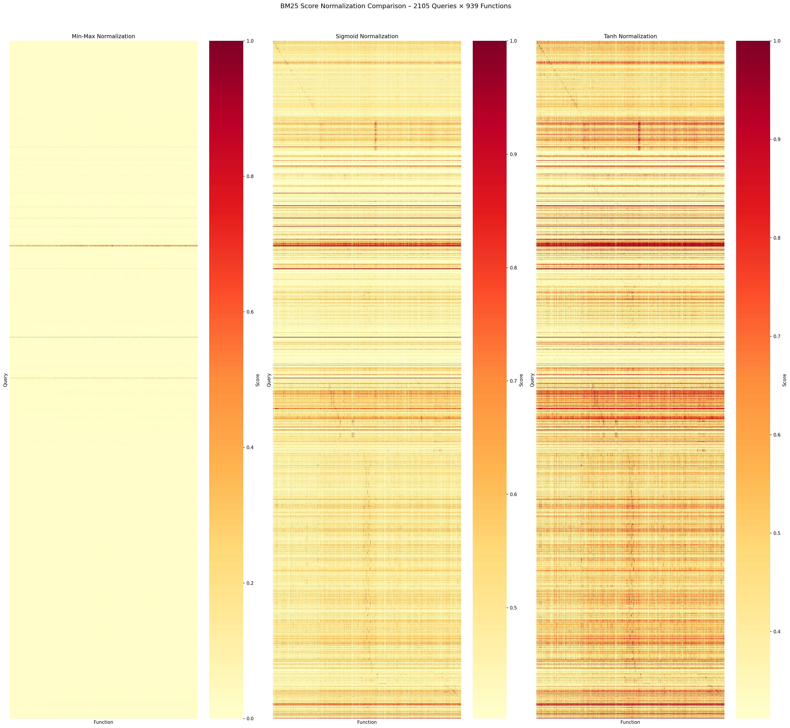
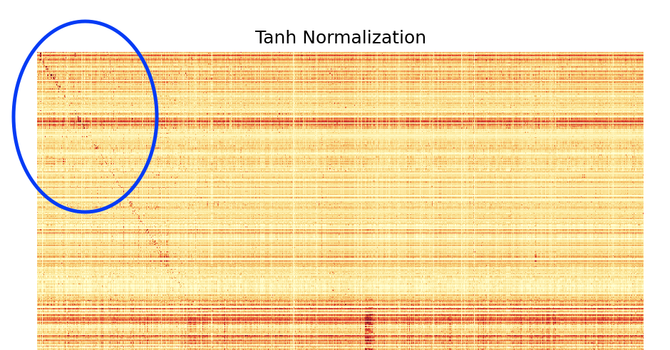
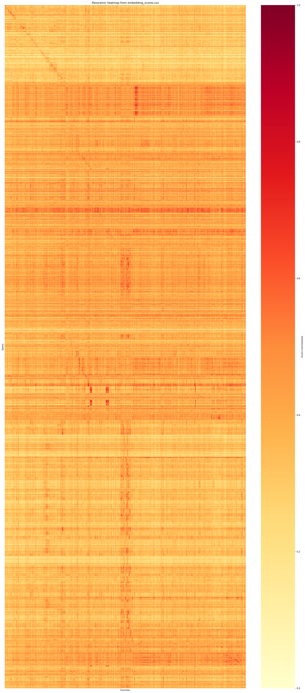

# A way to auto scaling capabilities for Agent

### Author by Github ID: SamYuan1990

## Abstract

todo:let LLM complete this?

## Background

With OpenAI announced function call for agentic(agent and LLM), we got some progress in past 3 years.
It's open a new area as function call under context enginnering, which allows agentic(agent and LLM) to access remote data(data outside LLM and current context window) and load it into context window as reading. Or it provides agentic(agent and LLM) capabilities writing data or change data status.
Soon after we have MCP, which is designed to provide a common protocol for function call, then skill with concept as "progressive disclosure" is a step further.
Anthropic blog with their opinion as skill plays role as workflow for agentic and MCP provides a way to access remote data.

## Problem & Goal

From function call to Skill, people get great progress on idea as "progressive disclosure". But eventually, there is some fundamental or structure limitation.
> In this paper, we defined function call/MCP/Skill as capability for short.

1. For any LLM to invoke a capability, LLM should know it. Typically it completed by having capability's description in context window to achieve.
2. This Approach takes size of context window, as context window is where people query LLM to achieve the busienss. Which causes:
    2.1 Either you defined capability in your workflow as hardcode.
    2.2 Or you put all capabilities together send to LLM, let LLM to judge which one should step further with an invoke(progressive disclosure).
3. As function call/MCP/Skill has different implement workflows so it's hard to progressive disclosure in a common way.

Take BFCL as an example, this test case is designed to todo:xxx. In this test case(ref github version url http://github.com/ShishirPatil/gorilla , with commit hash 6ea57973c7a6097fd7c5915698c54c17c5b1b6c8) it defined 2233 tasks, for each task hard code at least one capability description.

Imaging if BFCL's 2233 tasks are all tasks or workflows in a company or OpenClaw usage case. Among those 2233 tasks, there are 6641 function call defined, but after deduplicate there only 939 unique defines. About 14% of function call defination are unique, which means you need to manage 2233 tasks among 939 capabilities by hard code.
Note: we pick up test case:
"BFCL_v4_irrelevance.json",
"BFCL_v4_live_irrelevance.json",
"BFCL_v4_live_multiple.json",
"BFCL_v4_live_parallel_multiple.json",
"BFCL_v4_live_parallel.json",
"BFCL_v4_live_relevance.json"

On the other hand, if we took those unique capabilities descritpion into context window and let LLM to pick up per query. Those 939 functions toke 62.4 tokens in avg.
Which means it will took about 58,593(58k) tokens for each query if you send them all to LLM and let LLM to select, even if with DeepSeek v4 api, it means 0.058593¥(about 0.01$) as input token cost per query. 
> ref ./example/BFCL/gothroughfunctions.py file. Maybe we should update it just calculate description only or calculate with full size after convert it into openai format?

Thus, we need to find a way to auto scaling those capability:
1. Manage those capabilities.
2. Inject capability before query in an automatice way.
3. Low cost and stable.
achieve progressive disclosure for either function cal, MCP or Skill.

## Idea & Method

The straightforward idea is as capability's description is text(c_text) and query is text(q_text), what LLM receives c_text_set(c_text_a ... c_text_n) and q_text, and pick up a specific c_text_s ask agent to execute.

A relevance filter among capabilities(c_text_set) and query(q_text) picks up top k accordingly to relevance score, changes the problem to a RAG search between capabilities(c_text_set) and query(q_text).

Which:
1. Manage those capabilities.
1.1 capability registered into a capabilities register.
2. Inject capability before query in an automatice way.
2.1 capabilities receives query return top k capabilities and inject into query.
3. Low cost and stable.

### Low cost in charge

To low the cost in charge, we used BM25 and BAAI embedding, as 硅基流动 provides it in free.
As DeepSeek doesn't provides embedding service, we make compare between Qwen.

｜ BM25 ｜ embedding | LLM |
|---| --- | --- |
| BM25 | BAAI | DeepSeek v4 |
| BM25 | Qwen | Qwen |

### Performance as variant to BCFL

BFCL focus on todo:xxx, which has different goals with us. So we changed BCFL as a variant.
1st of all, we collect all BCFL function define into a capabilities register.
> 1. Manage those capabilities.
> 1.1 capability registered into a capabilities register.

#### Irrelevance testcases

Which causes a problem when we run BCFL irrelevance testcases, as BCFL irrelevance testcases are designed to test LLM's behaviors when handle c_text_a and q_text are irrelevance.
In our case, as we collected with all functions across testcases, the irrelevance testcases will find some reasonable c_text_r.

For example
Orignal irrelevance testcase
```
Query:Solve the quadratic equation with coefficients a = 1, b = 2, and c = 3.
Tools:math.sum
```
After we collected all testcase
```
Query:Solve the quadratic equation with coefficients a = 1, b = 2, and c = 3.
Tools:find_roots(as 1st option)
```
Hence, the way we evaluate irrelevance turns to be, in our relevance filter result, the c_text_a will not appeared as best.

#### Parallel and multiple testcases

We don't want to manually maintain the capabilities injection. Hence we need to changes the way we evalute with parallel and multiple testcases.

> 2. Inject capability before query in an automatice way.
> 2.1 capabilities receives query return top k capabilities and inject into query.

In BFCL, the test case been designed as given c_text_a, c_text_b, c_text_c with q_text, test LLM's behaviors as pick up right capability with correct format.
In our case, we will filter out top k set as (c_text_1 ... c_text_k) from capabilities register and if the final result c_text_rs in the top k set, we mark it as a success.

### Impact to LLM's original behavior as base line

Just to see when we extend from manual give capabilities set to top k set, how it affects LLM's behavior.

## Result

### BM25 and it's Data distribution 

| File | items | Nothing changes |
| --- | --- | --- |
|BFCL_v4_irrelevance.json    | 240 |  26.25% |
|BFCL_v4_live_relevance.json    | 16 | 18.75% |
|BFCL_v4_live_irrelevance.json | 884 | 7.12% |

Nothing changes means the original wrong option still appears in BM25 Top 5 filter.

| File | items | Top1 | Top3 | Top5 |
| --- | --- | --- | --- | --- |
|BFCL_v4_live_parallel.json | 16 | 25% | 37.5% | 37.5% |
|BFCL_v4_live_parallel_multiple.json | 24 | 58.3% | 83.3% | 87.5% |
|BFCL_v4_live_multiple.json  | 1053 | 42.1% | 57.3% | 63.9% |

Top1,Top3,Top5 can been seen as recall@1,recall@3,recall@5 as the correct answer, appears in the top 5 list.
Note: For one query with multiple function calls as result, we just simple calculated by account +1 for each tool.

#### Normalize



According to the data disctirbution, divide by max(or say min-max), sigmod and tanh, shows different behaviors on heat map. The column are function call defines and the rows are querys(2233).
We can see divide by max usually just a "background" noise comparing with sigmod or tanh as for each query it seems just a flat line. As zoom parts below, we can see after tanh(as a "linear" function, tanh doesn't change the function call's orderer within a query) shows more relevance across querys and function call definations.



### Embedding and it's Data distribution 

| File | items | Nothing changes |
| --- | --- | --- |
|BFCL_v4_irrelevance.json    | 240 |  37.1% |
|BFCL_v4_live_relevance.json    | 16  | 81.2% |
|BFCL_v4_live_irrelevance.json | 884 | 30.0% |

| File | items | Top1 | Top3 | Top5 |
| --- | --- | --- | --- | --- |
|BFCL_v4_live_parallel.json | 16 | 56.2% | 93.8% | 93.8% |
|BFCL_v4_live_parallel_multiple.json | 24 | 58.3% | 79.2% | 83.3% |
|BFCL_v4_live_multiple.json  | 1053 | 57.7% | 77.2% | 84.3% |



As embdding shows relevance between query text and function call defination, we see a high nothing changes in BFCL_v4_live_relevance as in real life we attempt with given a function call but it's not relevance.
Meanwhile, it really improved the correction rate for BFCL_v4_live_parallel and BFCL_v4_live_multiple(1053 test case) as top5 reach to 93.8% and 84.3% among all 939 function calls.

### Linear BM25 with Embedding

It's a simple idea that we using an linear function as alpha * linear(BM25 score) + (1-alpha) * embedding score to see if we can improve the correct rate for BFCL_v4_live_parallel and lower the nothing changes rate if possible.

It seems nothing changes as BFCL_v4_live_irrelevance.json 67.6% with correction as BFCL_v4_live_multiple.json 86.4%, with normalize as minmax alpha=0.1 is the best record we can have. As by adding a linear parts it can help improve the correction for function call selection. For small data set as BFCL_v4_live_parallel or BFCL_v4_live_parallel_multiple we can get over 90% correction, as the major contribution should from embedding.

#### minmax

> Nothing changes

| Test file \ alpha | 0.1 | 0.2 | 0.3 | 0.4 | 0.5 | 0.6 | 0.7 | 0.8 | 0.9 |
|---|---|---|---|---|---|---|---|---|---|
| BFCL_v4_irrelevance.json | 59.6% | 65.0% | 67.5% | 68.3% | 69.2% | 70.8% | 72.1% | 72.5% | 73.8% | 
| BFCL_v4_live_irrelevance.json | 67.6% |  69.5% | 72.1% |  74.5% | 75.6% | 75.9% | 76.5% | 77.1% | 77.5% | 
| BFCL_v4_live_relevance.json | 18.8% | 18.8% | 18.8% | 25.0% |  25.0% | 31.2% | 37.5% | 37.5% | 37.5% | 

> Correction

| Test file \ alpha | 0.1 | 0.2 | 0.3 | 0.4 | 0.5 | 0.6 | 0.7 | 0.8 | 0.9 |
|---|---|---|---|---|---|---|---|---|---|
| BFCL_v4_live_multiple.json | 86.4% | 82.6% | 78.2% | 74.4% | 70.9% | 69.5% | 68.3% | 66.9% | 65.9% | 
| BFCL_v4_live_parallel_multiple.json | 91.7% |  95.8% | 95.8% | 95.8% | 91.7% | 95.8% | 91.7% | 91.7% | 91.7% | 
| BFCL_v4_live_parallel.json | 93.8% | 93.8% | 87.5% | 81.2% | 75.0% | 68.8% |  68.8% | 68.8% |  50.0% |

#### sigmod

> Nothing changes

| Test file \ alpha | 0.1 | 0.2 | 0.3 | 0.4 | 0.5 | 0.6 | 0.7 | 0.8 | 0.9 |
|---|---|---|---|---|---|---|---|---|---|
| BFCL_v4_irrelevance.json | 62.9% | 62.5% | 62.9% | 62.9% | 64.2% | 65.0% | 64.6% | 65.0% |  65.0% | 
| BFCL_v4_live_irrelevance.json | 69.0% | 69.2% | 69.7% | 70.4% | 69.9% | 70.1% | 70.7% | 70.8% | 72.3% | 
| BFCL_v4_live_relevance.json |  18.8% | 18.8% | 18.8% | 18.8% | 25.0% | 25.0% | 25.0% | 25.0% | 25.0% |

> Correction

| Test file \ alpha | 0.1 | 0.2 | 0.3 | 0.4 | 0.5 | 0.6 | 0.7 | 0.8 | 0.9 |
|---|---|---|---|---|---|---|---|---|---|
| BFCL_v4_live_multiple.json | 84.7% | 84.5% |  84.3% |  83.8% | 83.9% | 83.7% | 83.3% | 83.6% |  83.0% | 
| BFCL_v4_live_parallel_multiple.json | 83.3% | 83.3% | 83.3% | 83.3% | 83.3% | 83.3% | 83.3% | 83.3% | 83.3% | 
| BFCL_v4_live_parallel.json |  93.8% | 93.8% | 93.8% |  93.8% | 93.8% | 93.8% | 93.8% | 93.8% | 93.8% |


#### tanh

> Nothing changes

| Test file \ alpha | 0.1 | 0.2 | 0.3 | 0.4 | 0.5 | 0.6 | 0.7 | 0.8 | 0.9 |
|---|---|---|---|---|---|---|---|---|---|
| BFCL_v4_irrelevance.json | 64.6% | 65.0% | 65.0% | 64.2% | 64.2% |  63.7% | 65.0% | 65.0% | 65.0% | 
| BFCL_v4_live_irrelevance.json | 69.3% | 69.8% | 69.8% | 69.7% | 69.8% | 70.0% | 70.2% |  70.5% | 71.0% | 
| BFCL_v4_live_relevance.json | 18.8% | 18.8% | 18.8% | 18.8% | 18.8% | 25.0% | 25.0% |  25.0% | 25.0% | 

> Correction

| Test file \ alpha | 0.1 | 0.2 | 0.3 | 0.4 | 0.5 | 0.6 | 0.7 | 0.8 | 0.9 |
|---|---|---|---|---|---|---|---|---|---|
| BFCL_v4_live_multiple.json | 84.1% | 84.0% | 84.0% | 83.9% | 83.9% | 83.8% | 83.8% |  83.8% | 83.5% | 
| BFCL_v4_live_parallel_multiple.json | 83.3% | 83.3% | 83.3% | 83.3% |  83.3% | 83.3% | 83.3% | 83.3% | 83.3% | 
| BFCL_v4_live_parallel.json | 93.8% | 93.8% | 93.8% | 93.8% | 93.8% | 93.8% | 93.8% | 93.8% |  93.8% |


## Discussion

Back to the assumption, imaging if BFCL's 2233 tasks are all tasks or workflows in a company or OpenClaw usage case. Among those 2233 tasks, there are 6641 function call defined, but just about 14% are unique. 

> Case 1. People can always hard code function call when building agent. We hope by our work, can help to design a suggestion system. Considering people define their workflow with prompt template, either via WYSIWYG like langchain/dify or code base framework, the suggestion system can take prompt template and function call defines as text input and auto suggestion workable and usable function calls as options.

> Case 2. Aiming at harness, autonomous or a new function call appended. It's a huge work for people to go back and update 2233 tasks in manual. We hope this research provides a way to automatic inject function call into the query.

> Case 3. The key is the data distribution among the ecosystem(prompts and function call defines). In this paper, we also descripted the effective between BM25 and embedding, and affects for linear functions. Try to provides a low cost solution and ways to deal with different data distributions.

> Case 4. Influence to LLM response. As not all LLM provides embedding service, and how top k function call options influence LLM response is been discussed.

## Reference
1. Open AI announce function call
2. Anthropic MCP
3. Anthropic skill
4. context window paper
5. function call/mcp workflow
6. BFCL
7. RAG
8. BM25
9. BAAI embedding
10. 硅基流动

## Appendix
